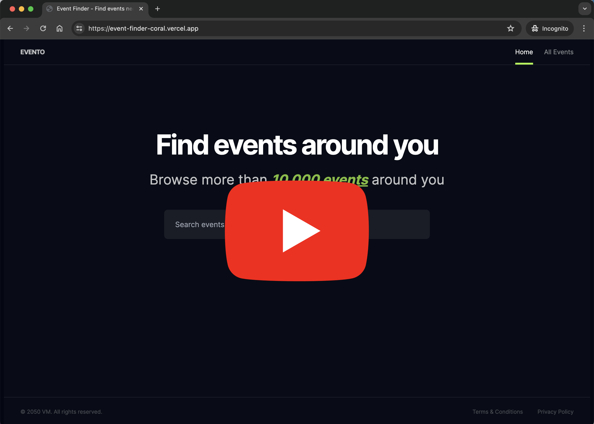

# Event Finder

Welcome to the Event Finder web application! This project helps users find events in specific cities, making it easier to explore and enjoy various activities. Below you'll find detailed information about the features, tech stack, and how to get started with the project.

[](https://youtu.be/6GHVFSZg3rM)

_(Right-click and select "Open link in new tab" to watch the video in a new tab.)_

## Features

- **Search Field**: Users can enter the name of a city to find events happening there.
- **Popular Cities Links**: Quick links to popular cities that people often search for, allowing easy access to event information in those locations.
- **Specific Event Details**: Users can look into specific events to get detailed information about the event, such as date, time, location, and description.

## Tech Stack

- **Next.js**: The React framework used for building the frontend and server-side rendering.
- **Vercel**: The platform used for deploying the web application.
- **Prisma/Postgres**: The database used for storing event data and other related information.

## Features

This application is designed for users who want to find events happening in various cities. With our user-friendly interface, you can effortlessly discover events based on your preferences and location.

Search Field: Users can enter the name of a city to find events happening there.
Popular Cities Links: Quick links to popular cities that people often search for, allowing easy access to event information in those locations.
Specific Event Details: Users can look into specific events to get detailed information about the event, such as date, time, location, and description.

## Getting Started

Before you begin, ensure you have the latest version of Node.js installed. This project uses Node.js 20.x or later.

### Installation

1. Clone the repository

   ```sh
   git clone git@github.com:vmalchik/event-finder.git
   cd event-finder
   ```

2. Install dependencies

   ```sh
   npm install
   # or
   yarn install
   ```

3. Setup with [Postgres or SQLite](./docs/db.md)

### Running the Application

To start the development server, run:

```sh
npm run dev
# or
yarn dev
```

Open your browser and navigate to http://localhost:3000/ to see the application in action.

### Building for Production

```sh
npm run build
# or
yarn build
```
